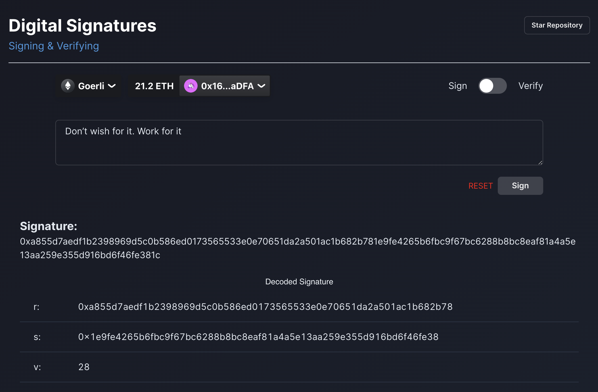
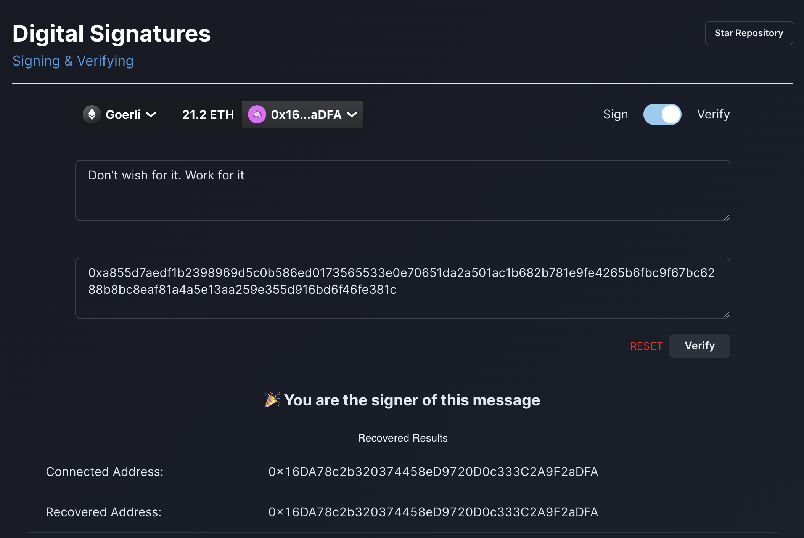
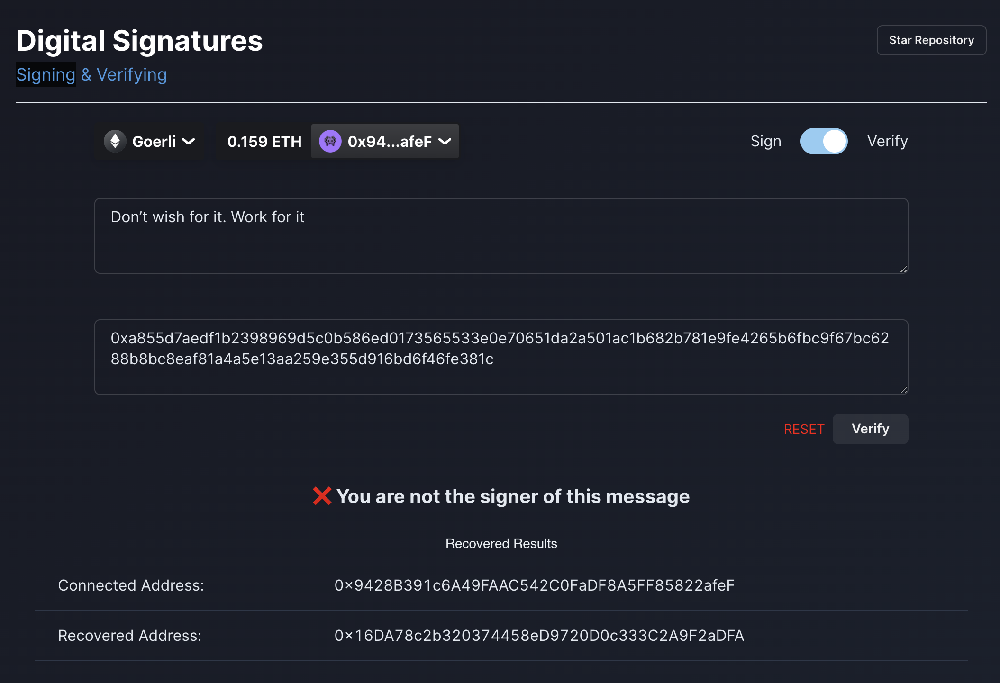

# Digital Signatures

Simply connect your wallet and sign a message. You can then verify the message was signed by the wallet address.

## Signed message

  

## Verified message

  

## Invalid verification

  

